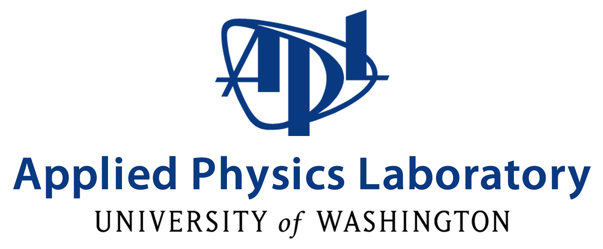
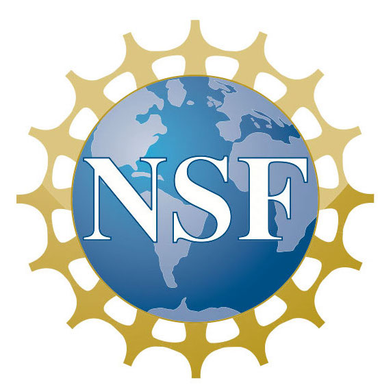
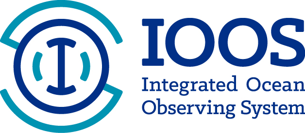

# OceanHackWeek

```{admonition} Updates in progress
:class: warning

We're currently updating the site for OceanHackWeek 2022, but you can put August 15-19th on your calendar. We've got some new things planned, so stay tuned!

```

While OceanHackWeek 2021 has finished, we're scheming what's next for the OceanHackWeek community.
If you've got any idea's please get in touch!

In the meantime please explore some of the results from this and past years projects, and sign up to get notified when we next have an event.

## About OceanHackWeek</h2>

OceanHackWeek (OHW) is a 4-day collaborative learning experience aimed at exploring,
creating and promoting effective computation and analysis workflows for
large and complex oceanographic data. It includes tutorials, data exploration, software development, collaborative projects and community networking.
Its objectives are to:
				
- Promote data and software proficiency in ocean scientists: Provide participants with computational and data science skills that can advance oceanography research, which often requires the integration and manipulation of diverse sources of data and models.
- Facilitate inclusive community building: Connect oceanographers across disciplines and career stages and cultivate an open science and a sharing culture.


<!-- OceanHackWeek 2021 will take place as a hybrid in-person and virtual, online event. The in-person event will take place at the Bigelow Laboratory for Ocean Sciences, in East Boothbay, Maine (US EDT, UTC-4), as an all-day workshop (approximately 9am - 5pm). For the virtual event, formal daily activities will take place over a period of up to 3 hours per day. We expect to hold these sessions in at least two time zones, USA PDT (UTC-7) and Australian EST (UTC+10). -->

<!-- ## Information For Applicants

OceanHackWeek (OHW) 2021 will take place as a hybrid in-person and virtual, online event. Applications closed on June 28, 2021. In OceanHackWeek we will explore the intersection of data science and oceanography through tutorials and hands-on “hacking” projects. To best benefit from the program, participants are expected to have some experience with Python or R programming and data analysis. -->

## Participant Quotes

```{epigraph}
My experience at the Oceanhackweek 2019 was in a few words a once in a lifetime learning experience. The people involved were amazing, from the organization group to all the participants. The project group I joined was extremely democratic and involved. I learned not only from more advanced researchers but also telling what I knew to my group partners. I definitely recommend this event for everyone that is eager to learn.

-- Ágata Piffer Braga, 2019 Participant
```

```{epigraph}
I feel so lucky that I didn't miss the brainstorm of the data techniques in OHW2019. I have been using python for data analysis abut two years. [...] And I was quite satisfied with Python packages [...] which are extensively used in my data analysis for numerical model outputs. So when I heard about Oceanhackweek, I expected that probably I could meet more Python fellows in the ocean community, and it will be very beneficial to stay in a community for debugging and learn new staff in future works. Actually, the week spent in OHW2019 paid me much more than I could ever have expected. Packages, such as xarray and Dask, expanded my vision on python’s applications in ocean data analysis. Lectures on Github opened the door of so many repositories of open-source projects. Pangeo provided a cutting-edge platform for oceanographers to use packages specifically written for ocean data. Cloud data storage and cloud computation demonstrated great potential for ocean researches. And the project work during the workshop really makes our hands dirty in using the techniques we learned. Our team worked on quality control using machine-learning methods. It was a lot of cooperation, hardworking, fun, and friendships.

-- Xu Chen, 2019 Participant
```

```{epigraph}
The workshop provided an excellent introduction to the existing infrastructure of oceanographic data-gathering resources. Also provided was an introduction to the open-source evolving tools for accessing and utilizing large data sets. The technical challenges in data-intensive research are daunting, and here this workshop’s model and enactment of collaborative work was particularly valuable to me.

-- Rachel Jackson, San Francisco State University, 2018 Participant
```

```{epigraph}
I am grateful to have attended Oceanhackweek, and to have been given the opportunity to expand my skill set in such a productive and pleasant environment. I live in Fairbanks, AK, where we are rather isolated and aren't naturally exposed to new tools or methods. [...] Oceanhackweek gave me that time, introduced me to possibilities via the tutorials, and through the projects produced a technical structure that I can apply to our research in Alaska.

-- Liz Dobbins, University of Alaska, Fairbanks, 2018 Participant
```

```{epigraph}
It is sometimes hard to predict whether a given conference, training or hack-a-thon might be worth your time. [...] The real challenge, of course, is to find a group of like minded people that want to expand their horizons and learn together, and that is just what I found when I attended Ocean Hackweek.

-- Christian Saranson, 2018 Participant
```

## OceanHackWeek 2021 Sponsors

Thanks to our sponsors that make this event possible.

<div class="row">
<div class="col-4" style="margin-bottom: 1rem">


</div>
<div class="col-4" style="margin-bottom: 1rem">


</div>
<div class="col-4" style="margin-bottom: 1rem">



</div>
<div class="col-4" style="margin-bottom: 1rem">



</div>
<div class="col-4" style="margin-bottom: 1rem">



</div>
<div class="col-4" style="margin-bottom: 1rem">


</div>
</div>

<!-- ## Location and Time Zones

In-person workshop: Bigelow Laboratory for Ocean Sciences, East Boothbay, Maine (US EDT, UTC-4).

Virtual event: We expect to hold formal sessions in at least two time zones, USA PDT (UTC-7) and Australian EST (UTC+10). -->

```{toctree}
:maxdepth: 2
:hidden:
about/index.md
2022/index.md
resources/index.md
posts
```
