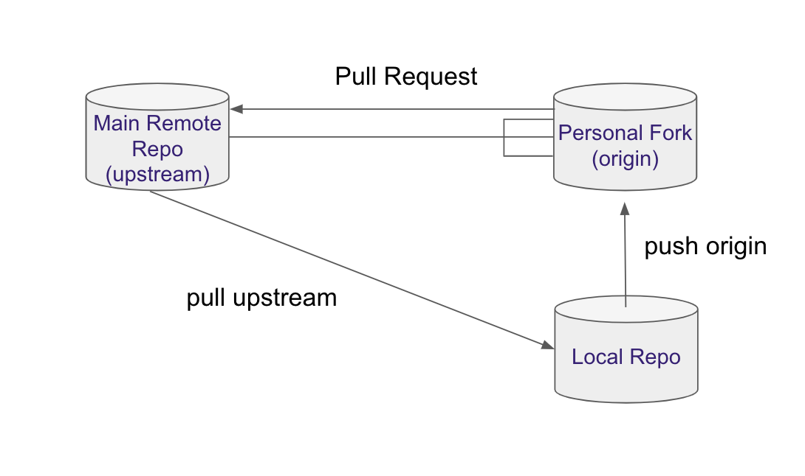

# Git Setup and Basics

:::{admonition} Updates in progress
:class: warning

The resources are actively being updated! Some parts are still out of date, and is the content from last year. In the meantime, please watch out for references to 2021 ("OHW21") or links that don't work.

:::

## About Git and GitHub

[Git](https://git-scm.com/) is a popular version control system that is the foundation of most open source software development. You are not required to be a Git pro in advance of this event, but come prepared to learn a lot about it! [GitHub](https://github.com) is a hosting service for Git repositories, enabling us to share code across teams in a web environment.

We will use Git and GitHub for collaborative work. Be sure to arrive at OceanHackWeek with your own [GitHub](https://github.com/) account.

## Git Installation

* Windows
    * Install Git for Windows from this [link](https://gitforwindows.org/). For more setup details follow these [instructions](https://carpentries.github.io/workshop-template/#shell)
* Mac OS
    * Download the [git installer](https://git-scm.com/download/mac) and run it. 
* Linux (Debian): `sudo apt install git-all`

To test, open the terminal (on Windows, Git Bash) and setup your username and email:

```bash
git config --global user.name "your username"
git config --global user.email "your email"
```


## Getting started with Bash terminal

During the hackweek it will be useful to know how to navigate between files from the command line. If you are not familiar with the linux shell commands, you can review the first three sections of this [Software Carpentry Shell Novice](https://swcarpentry.github.io/shell-novice/) lesson. On Windows, use the Git Bash terminal to run these commands.


## Terminal (command line) text editor

When working on the command line (the terminal or shell), it is often handy to modify file content directly from there. For that you can use a command line editor such as [nano](https://linuxize.com/post/how-to-use-nano-text-editor/). On Mac and Linux it is usually pre-installed, but for Windows you can follow the instructions in this [link](http://carpentries.github.io/workshop-template/#editor) to set it up. Test your installation by opening a terminal and running `nano --version`. If it works you can link your git configuration with `nano`:

```bash
git config --global core.editor "nano -w"
```


## Git steps and workflows

```{admonition} "Centralized vs Fork-Clone workflows"
Steps 1-5 focus on the Git "centralized workflow". We present it here as an illustration, but **the workflow we recommend for use in OceanHackWeek is the Git Fork - Clone workflow, discussed in Step 6.**
```


### 1. Create a project repository

On your own or someone in your project group (preferably one who has never done it before), create a repository for the project under the {OceanHackWeek organization, [https://github.com/oceanhackweek](https://github.com/oceanhackweek)


Click `New` and follow the steps: check yes to create a `README.md` file.

* Format project name as `ohw22-proj-myprojectname` (you can change the name later), where `myprojectname` is a brief name for your project
* Invite others to the repo:
    * `Settings -> Collaborators`
    * Note to collaborators: you will receive an invitation to your email associated with github.com. If you cannnot find it look for the `bell` notifications on the top right of the website.

### 2. Clone the repository

Each participant should clone the repository so they have their copy on their JupyterHub account space (and locally in the participant's computer, if desired). Navigate through the terminal to the folder where you want to keep {OceanHackWeek work (`cd path_to_oceanhackweek`).

```bash
git clone https://github.com/oceanhackweek/ohw22-proj-myprojectname.git
```

This will create a new folder called `ohw22-proj-myprojectname`. Navigate to the new folder, `ohw22-proj-myprojectname`.

### 3. Update the README with your name

Open the `README.md` file with your favorite editor and create a new section header. Under this section add your name. Then add this change, commit it to the local repository, and push it so that it appears on the `origin` GitHub repository.

```bash
git add README.md
git commit -m "Adding new name to README.md"
git push origin
```

Make sure your change appears online.

```{admonition} "Remember to run:"
`git status` to observe the changes made into your repository. Pay attention to the colors. To see the changes in the files run `git diff`.
```


### 4. Update your local repository (local clone) with the changes of your collaborators

```bash
git pull origin master
```

```{admonition} "Remember `origin` is just a short name of the web address of the repository."
To see what is hidden in origin: `git remote -v`
```

To continue practicing these steps, make more changes to the title and the description of the project.


*Ran into a problem?*

When working with several people sometimes you

* cannot push because changes have been made that have not been incorporated: need to first pull
* when pulling you arrive into a merge conflict: need to resolve the conflict manually


### 5. Resolving the merge conflict

```bash
git status
```

You will see the file/s which caused the merge conflict in green.

Open it and detect the conflict by the special format:

```
<<<<<<< HEAD
my text
=======
somebody else's text
>>>>>>> 35ab35436
```

Decide which changes you want to keep, and modify the file so it looks as you wish directly from the editor. Remove the unnecessary characters. Add, commit and push the changes.

```bash
git add README.md
git commit -m "resolving merge conflict"
git push origin master
```

You can continue working on as usual.

```{admonition} "Remember to pull often and push small changes ..."
... to avoid messing with complicated merges and keep your repo up-to-date.
```


### 6. Avoiding problems: forking workflow

So far you collaborated using what is called a "centralized git workflow": i.e. every collaborator makes directly changes to the repo.


Many merge conflicts can be avoided by working with **forks** (using a "forking git workflow) instead of directly pushing to the repo.

```{admonition} "Forking Git Workflow"
This is the workflow covered in the OHW20 pre-hackweek presentation on 2020-8-6. The presentation [pdf is here](https://raw.githubusercontent.com/oceanhackweek/ohw-preweek/master/git-github-survival-guide/Git-GitHub-survival-guide.pdf), and the [recording is here](https://youtu.be/7nYFRixSV2c); **the workflow is the one recommended for use in OHW22.** 
Here's an excellent guide to the Forking Git Workflow: [Step-by-step guide to contributing on GitHub](https://www.dataschool.io/how-to-contribute-on-github/)
```

Forks are public copies of the main repo, from which you can submit changes to the main repo.


* Sync your local repo with the public one
* Fork the public repo (click on the *Fork* button)

* Note it looks the same but the web address contains your username
  [https://github.com/myghusername/ohw21-proj-ProjectName](https://github.com/myghusername/ohw21-proj-ProjectName)
* Go to your local repo and rename your `origin` to point to the fork:

```bash
git remote rm origin
git remote add origin https://github.com/myghusername/ohw21-proj-ProjectName.git
```

* Add a new remote to talk to the main repo:

```bash
git remote add upstream https://github.com/oceanhackweek/ohw21-proj-ProjectName.git 
```

From now on you will push to `origin`, but pull from `upstream`.

```{warning}
Make sure your `origin` contains your github username, and upstream contains the `oceanhackweek` name.
```

```{admonition} Hint
:class: toggle
Github has a handy [command line tool `gh`](https://cli.github.com/). If you fork a repo and use the `gh` command shown on the page to clone the repo, it will set `upstream` and `origin` appropriately for you.
```

#### Submitting changes via a pull request

Make some changes to a file and commit and publish them.

```bash
git add README.md
git commit -m "more changes"
git push origin master
```

```{admonition} Note
They appear on your fork, but not on the main repo.
```

Submit a pull request by clicking `New pull request`:


* Explain what changes you have made.
* Assign somebody for review.
* Reviewer: look through changes in the files
* Approve PR or ask for more changes.

```{admonition} Note
While your pull request is pending, any change you push to the fork will become a part of the request. This is useful if you are asked to make small changes before your PR is accepted.
```

In general we encourage github users to submit changes to the main repo through pull requests, but direct push is still a viable workflow for small projects when participants work on the same documents.




## Troubleshooting

### Deleting files

```bash
git rm filename.txt
rm filename.txt
```

```{admonition} Note
`git rm` just removes the file from git, to delete the file completely use the bash `rm` command after that.
```

### Reverting to the previous commit

```bash
git revert HEAD
```
	
```{admonition} Note
Your files in the local repo will still be there.
```

## References and Resources

Git and GitHub are very powerful tools but no doubt the learning curve is steep. Learning is an iterative process so below we list some resources which can help you be better prepared:

* OceanHackWeek (OHW) tutorials
    * OHW20 tutorial: Git/GitHub Survival Guide presentation. [pdf](https://raw.githubusercontent.com/oceanhackweek/ohw-preweek/master/git-github-survival-guide/Git-GitHub-survival-guide.pdf) and [video](https://youtu.be/7nYFRixSV2c)
    * OHW19 tutorial: Git, GitHub, and Project Collaboration. [presentation files](https://github.com/oceanhackweek/ohw19-tutorial-github) and [video](https://www.youtube.com/watch?v=wWKDp4Uw25A&list=PLA6PlfxWZPLTPQ_OIr3dDPF9FRiHQXoVF&index=14&t=0s). This tutorial is the source of most of the materials for this Git page.
* [git-novice - Software Carpentry Lesson](http://swcarpentry.github.io/git-novice/) (3 hours with exercises)
* [Setting Up Git - Software Carpentry Lesson](https://swcarpentry.github.io/git-novice/02-setup/index.html)
* [Atlassian Tutorials - Version Control](https://www.atlassian.com/git/tutorials/what-is-version-control)
* An excellent guide to the Forking Git Workflow: [Step-by-step guide to contributing on GitHub](https://www.dataschool.io/how-to-contribute-on-github/)
* [What is GitHub?](https://www.youtube.com/watch?v=w3jLJU7DT5E) (3:45 min)
* [GitHub Learning Lab](https://lab.github.com/): practice with a bot! (On your own pace)
* [An interactive Git Tutorial: the tool you didn’t know you needed. From personal workflows to open collaboration](https://berkeley-stat159-f17.github.io/stat159-f17/lectures/01-git/Git-Tutorial..html)
* [GeoHackWeek 2019 tutorial: Getting started with Git](https://geohackweek.github.io/Introductory/03-git-tutorial/)
* [ICESAT-2HackWeek intro-jupyter-git repo](https://github.com/ICESAT-2HackWeek/intro-jupyter-git), with several notebooks going into a lot of detail.
