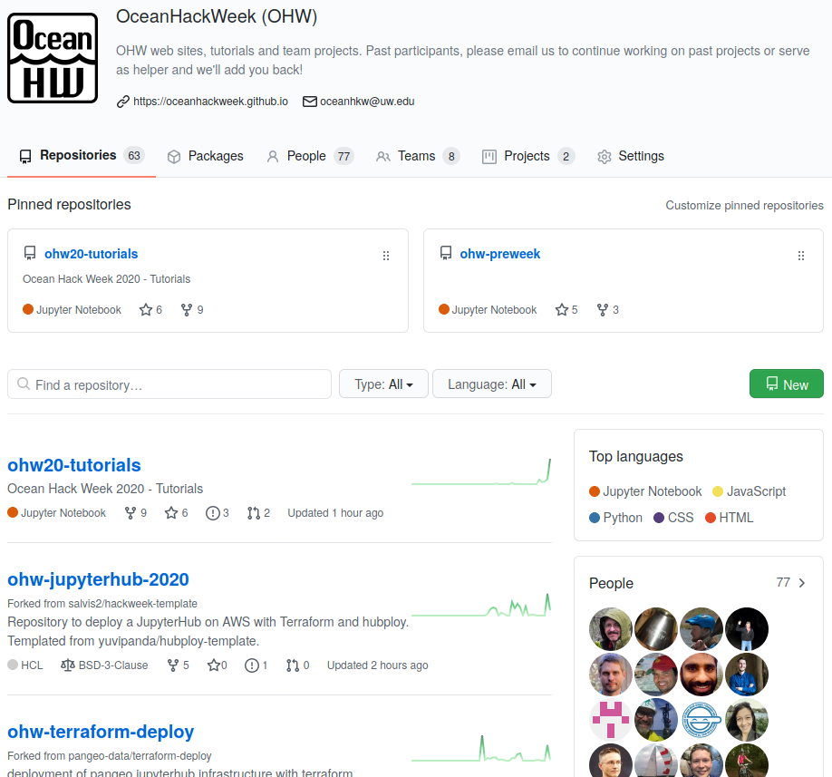

# GitHub

:::{admonition} Updates in progress
:class: warning

The resources are actively being updated! Some parts are still out of date, and is the content from last year. In the meantime, please watch out for references to 2021 ("OHW21") or links that don't work.

:::

## About Git and GitHub

[Git](https://git-scm.com/) is a popular version control system that is the foundation of most open source software development. You are not required to be a Git pro in advance of this event, but come prepared to learn a lot about it! [GitHub](https://github.com) is a hosting service for Git repositories, enabling us to share code across teams in a web environment.

We will use Git and GitHub for collaborative work. Be sure to arrive at {OceanHackWeek with your own [GitHub](https://github.com) account.

## Why do I need a GitHub account?

There are two reasons you are required to have a GitHub account for the hackweek:

1. All of our tutorials and project work will be shared on GitHub
2. You will want a GitHub account to practice everything you'll be learning during the Git/GitHub tutorials

So, if you don't already have a GitHub account, just navigate to [GitHub](https://github.com/):

Then, click on the big green button and then answer a few required questions. Be sure to save your password somewhere safe because you will need it later!

## Why are we joining a GitHub Organization?

GitHub organizations are a convenient way for teams to get all content relevant to a specific project or workshop into one place. By having everything in one central location you will spend less time searching for hackweek content. GitHub organizations have "teams" that offer simple ways to provide respository access to groups of people, rather than individuals.

We have created a GitHub organization called "oceanhackweek" at [https://github.com/oceanhackweek](https://github.com/oceanhackweek). For security purposes you can only join the organization by invitation. You should already have received the invitation to GitHub. If you didn't:

1. Once you have a GitHub ID, in the `#ohw22-helpdesk` Slack channel ask for help and include `@help-infrastructure` in your message so that folks who have the ability to make changes are notified.
2. We will then send you an invitation which should generate an email notification to the email you provided when you signed up for GitHub
3. Follow the links in the email to accept the invitation

## How will GitHub repositories be structured?

When you click on the "Repositories" tab in the [OceanHackWeek](https://github.com/oceanhackweek) GitHub Organization you will see a list of names, each of which links to a separate GitHub repository:

Each repository is a container for a specific subset of material for this event. For example, we have a separate repository for each past project. There is a repository for the public-facing website you used to register for this event, and a repository for the Resources web site. We'll also create new repositories for each project when we meet in person.

## How do I learn more?

We encourage you to start practicing with Git and GitHub in advance of this event. See the additional resources listed in the [Git page](git.md).
