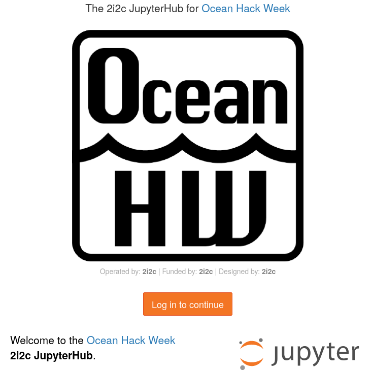
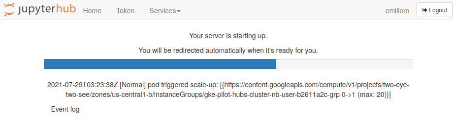
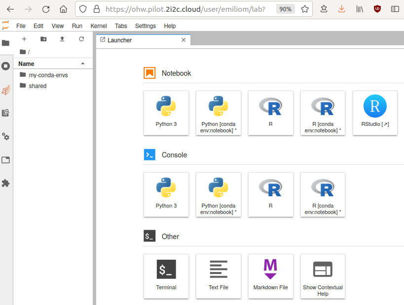
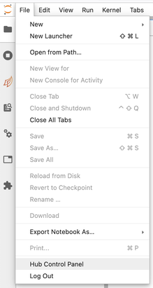

# Jupyter and the Hub

:::{admonition} Updates in progress
:class: warning

The resources are actively being updated! Some parts are still out of date, and is the content from last year. In the meantime, please watch out for references to 2021 ("OHW21") or links that don't work.

:::

## Jupyter notebooks and the Jupyter ecosystem

You may have heard of [Jupyter](https://en.wikipedia.org/wiki/Project_Jupyter) -- an open computing "ecosystem" developed by [Project Jupyter](https://jupyter.org). This ecosystem is described succinctly and effectively in [the online open book, Teaching and Learning with Jupyter](https://jupyter4edu.github.io/jupyter-edu-book/):

> Project Jupyter is three things: a collection of standards, a community, and a set of software tools. Jupyter Notebook, one part of Jupyter, is software that creates a Jupyter notebook. A Jupyter notebook is a document that supports mixing executable code, equations, visualizations, and narrative text. Specifically, Jupyter notebooks allow the user to bring together data, code, and prose, to tell an interactive, computational story. ([*"2.2 But first, what is Jupyter Notebook?"*](https://jupyter4edu.github.io/jupyter-edu-book/why-we-use-jupyter-notebooks.html#but-first-what-is-jupyter-notebook))

We will use the [JupyterLab](https://jupyterlab.readthedocs.io/en/stable/) software to create, manage and run Jupyter notebooks. You will be exposed to Jupyter notebooks throughout the hackweek, including in most tutorials. To learn more about Jupyter, Jupyter notebooks and JupyterLab:

- Check out several sections in the *Teaching and Learning with Jupyter* online open book, specially [Chapter 5 Jupyter Notebook ecosystem](https://jupyter4edu.github.io/jupyter-edu-book/jupyter.html).
- See the OceanHackWeek 2020 pre-hackweek tutorial "Jupyter and Scientific Python basics: numpy, pandas, matplotlib", which demonstrates effective Jupyter use both on your computer ("locally") and on JupyterHub: [Jupyter notebooks](https://github.com/oceanhackweek/ohw-preweek/tree/master/data-analysis-modules) — [tutorial video](https://youtu.be/CTUAgpvfze0). The video includes Q&As at the end where you'll find common questions you may find asking yourself.
- See the [resources at the end of this page](#references-and-resources).

## Why are we using a shared cloud computing environment?

Teaching software to a diverse group of participants, each with different computers and operating systems, can be challenging. There are specific ways to configure our software for the tutorials to be successful, so it takes time to get everyone set up consistently. Our solution to this is to give everyone access to a cloud computing environment that is pre-configured for the specific software we will deploy. This cloud computing instance can be accessed from any web browser, which eliminates the need for configuring each person's individual computer. For this hackweek we have created virtual computing instances that can be deployed on demand in a parallel computing environment. We use JupyterHub as a way to give a Jupyter Notebook server ([JupyterLab](https://jupyterlab.readthedocs.io/en/stable/)) to each person in a group. [These (slightly old) slides](https://www.slideshare.net/willingc/jupyterhub-a-thing-explainer-overview?from_action=save) give a nice overview of what JupyterHub is all about. JupyterHub enables us to quickly begin working with code without spending time to get the necessary libraries and dependencies set up on everyone's individual computers.

We encourage you to use our shared JupyterHub resources for running all the tutorials and for your projects. We also hope you will practice installing Python libraries locally on your laptop so that you can continue working after leaving our event.

## How do I access the shared cloud environment?

Access to our shared cloud environment is easy. Click on [https://ohw.pilot.2i2c.cloud](https://ohw.pilot.2i2c.cloud)



You can now click on the "Log in to continue" button, then on the next screen click on "Sign in with GitHub" to grant JupyterHub the required permissions. In the next window, enter your GitHub username (or email address) and password. 
You will then see something like this while the JupyterHub {OceanHackWeek 2022 server environment is loading:



It will take a bit of time for this to load - be patient! Once things are spun up you will see your very own instance of a [JupyterLab](https://jupyterlab.readthedocs.io/en/stable/) graphical user interface:



## How do I get the tutorial repository?

For the tutorials, there are two primary ways of getting the notebooks. You can use the traditional git management route ([described below](#How-do-I-get-my-code-in-and-out-of-JupyterHub)), or you can use [this magical nbgitpuller link](https://ohw.pilot.2i2c.cloud/hub/user-redirect/git-pull?repo=https%3A%2F%2Fgithub.com%2Foceanhackweek%2Fohw-tutorials&urlpath=lab%2Ftree%2Fohw-tutorials%2F&branch=master). 

Nbgitpuller is nice, because it will automatically merge any changes you make with the changes from the upstream repo on subsequent pulls via a [series of sane rules](https://jupyterhub.github.io/nbgitpuller/topic/automatic-merging.html#topic-automatic-merging).

You can accomplish the same results as nbgitpuller when using `git` directly, but it can take a complicated dance of `git add`, `git stash`, `git pull`, and `git stash apply` to keep your changes and get the changes from upstream.

```{warning}

If you start by using the nbgitpuller link, and then switch to using git directly, using the nbgitpuller link again will most likely lead to [unpredictable results](https://jupyterhub.github.io/nbgitpuller/#when-to-use-nbgitpuller).
```


## How do I get my code in and out of JupyterHub?

When you start your own instance of JupyterHub you will have access to your own virtual drive space. No other JupyterHub users will be able to see or access your data files. Next we will explain how you can upload files to your virtual drive space and how to save files from JupyterHub back to another location, such as GitHub or your own local laptop drive.

First we'll show you how to pull some files from GitHub into your virtual drive space.  This will be a common task during the hackweek: at the start of most tutorials we'll ask you to "clone" (make a copy of) the GitHub repository corresponding to the specific tutorial being taught into your JupyterHub drive space.

To do this, we will need to interface with the JupyterHub file system. JupyterHub is deployed in a Linux operating system and we will need to open a terminal within the JupyterHub JupyterLab interface to manage our files. There are two ways to do this: (1) Navigate to the "File" menu, choose "New" and then "Terminal" or (2) click on the "terminal" button in JupyterLab:


This will open a new terminal tab in your JupyterLab interface:


You can issue any Linux commands to manage your local file system.

Now let's clone a repository (see the [Git Setup and Basics](../prep/git.md) page). We'll illustrate this with the `ohw-tutorials` repository. First, navigate in a browser on your own computer to the repository link [https://github.com/oceanhackweek/ohw-tutorials](https://github.com/oceanhackweek/ohw-tutorials). Next, click on the green "Code" button and then copy the url into your clipboard by clicking the copy button (clipboard icon):


Now navigate back to your command line in JupyterLab. Type `git clone` and then paste in the url:

```bash
git clone https://github.com/oceanhackweek/ohw-tutorials.git
```

After issuing the `git clone` command you should see something like this (again, the screenshot below is for a different repo, but the concept is identical):


## End your Hub session every day. Will I lose all of my work?

**When you are finished working for the day or for an extended period of time, it is important to explicitly shutdown your JupyterHub session,** to reduce the load on our cloud infrastructure and overall costs. 

**To shutdown your server**, if you are viewing JupyterLab, you access the control via `File > Hub Control Panel` menu item:



Then you can shutdown your server from your hub control panel (which you can also access directly from https://ohw.pilot.2i2c.cloud/hub/home ):


Note that the menu item `File > Log Out` doesn't actually shut down the server, so please follow these steps instead.

```{warning} You will not lose your work when shutting down the server

Shutting down (Stop Server) will **NOT** cause any of your work to be lost or deleted. It simply shuts down some resources. It would be equivalent to turning off your desktop computer at the end of the day.

```

## How do I do distributed computation?

[Dask](https://dask.org/) is available on the JupyterHub for distributed compute.

To start up a Dask cluster, call

``` python
from dask.distributed import Client
from dask_gateway import GatewayCluster

cluster = GatewayCluster()
client = Client(cluster)

# xarray becomes even more awesome
```

And then either call `cluster` on it's own line in a cell and use the UI, or `cluster.scale(NUMBER_OF_WORKERS_TO_SCALE_TO)`.

```{admonition} Note

Just as it can take a few minutes for JupyterHub to start up your server, it can also take a few minutes before Dask workers become available. 

We are working on making Dask (and server) scaling faster, but no promises of faster scaling at this point.
```

Similar to your server, please shutdown your Dask clusters when you are done.

``` python
cluster.shutdown()  # or cluster.close()
```

## References and Resources

- [Why Jupyter is data scientists’ computational notebook of choice. An improved architecture and enthusiastic user base are driving uptake of the open-source web tool (Nature, 2018-10)](https://www.nature.com/articles/d41586-018-07196-1)
- [Teaching and Learning with Jupyter](https://jupyter4edu.github.io/jupyter-edu-book/), an online open book.
- OceanHackWeek 2020 pre-hackweek tutorial "Jupyter and Scientific Python basics: numpy, pandas, matplotlib": [Jupyter notebooks](https://github.com/oceanhackweek/ohw-preweek/tree/master/data-analysis-modules) — [tutorial video](https://youtu.be/CTUAgpvfze0).
- From [https://dataquest.io](https://dataquest.io)
    - [Jupyter Notebook for Beginners: A Tutorial](https://www.dataquest.io/blog/jupyter-notebook-tutorial/)
    - [Tutorial: Advanced Jupyter Notebooks](https://www.dataquest.io/blog/advanced-jupyter-notebooks-tutorial/)
    - [28 Jupyter Notebook Tips, Tricks, and Shortcuts](https://www.dataquest.io/blog/jupyter-notebook-tips-tricks-shortcuts/)
- [Getting Started with JupyterLab](https://www.blog.pythonlibrary.org/2019/02/05/getting-started-with-jupyterlab/)
- [Lesson 0b: Introduction to JupyterLab - (Justin Bois) Introduction to Data Analysis in the Biological Sciences, Caltech](http://bebi103.caltech.edu.s3-website-us-east-1.amazonaws.com/2019a/content/lessons/lesson_00/l00b_intro_to_jupyterlab.html)
- [Jupyter Lab: Evolution of the Jupyter Notebook. An overview of JupyterLab, the next generation of the Jupyter Notebook.](https://towardsdatascience.com/jupyter-lab-evolution-of-the-jupyter-notebook-5297cacde6b)
