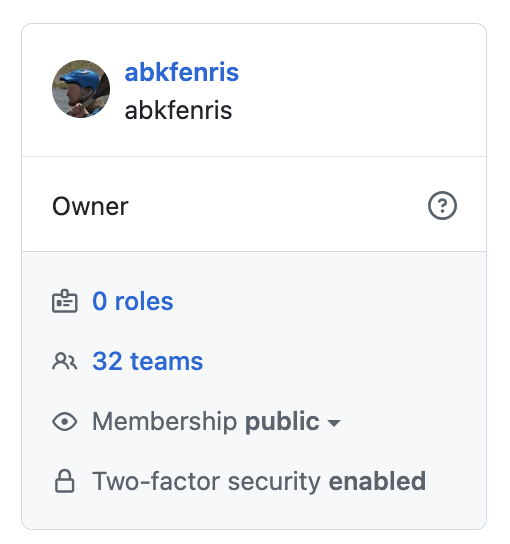
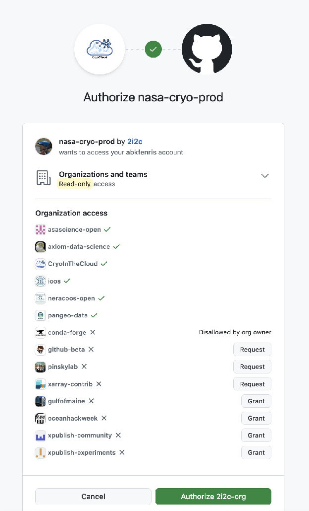
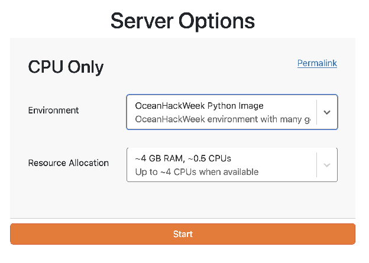
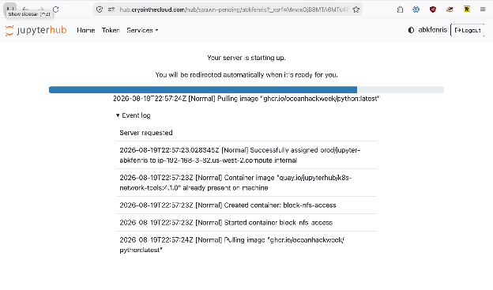
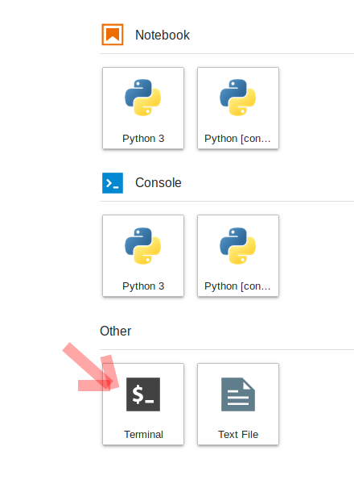
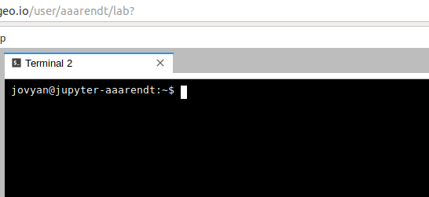
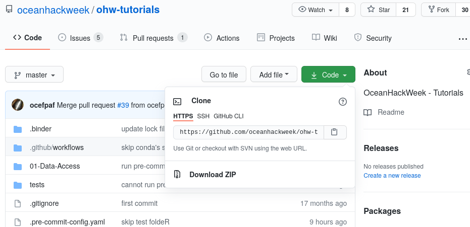
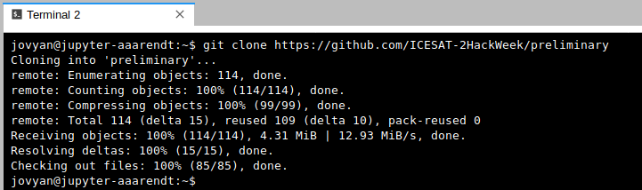
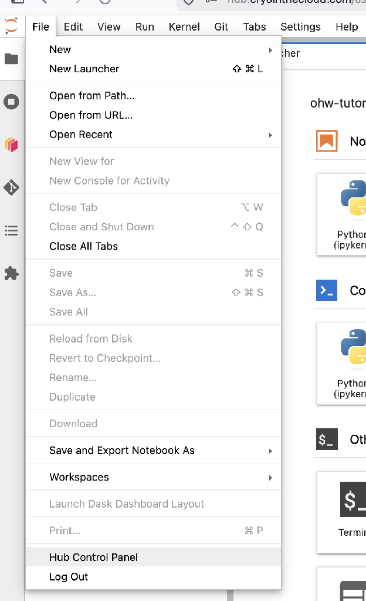
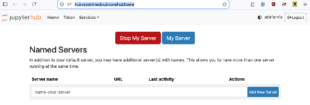

# JupyterHub

## Jupyter notebooks and the Jupyter ecosystem

You may have heard of [Jupyter](https://en.wikipedia.org/wiki/Project_Jupyter) -- an open computing "ecosystem" developed by [Project Jupyter](https://jupyter.org). This ecosystem is described succinctly and effectively in [the online open book, Teaching and Learning with Jupyter](https://jupyter4edu.github.io/jupyter-edu-book/):

> Project Jupyter is three things: a collection of standards, a community, and a set of software tools. Jupyter Notebook, one part of Jupyter, is software that creates a Jupyter notebook. A Jupyter notebook is a document that supports mixing executable code, equations, visualizations, and narrative text. Specifically, Jupyter notebooks allow the user to bring together data, code, and prose, to tell an interactive, computational story. ([*"2.2 But first, what is Jupyter Notebook?"*](https://jupyter4edu.github.io/jupyter-edu-book/why-we-use-jupyter-notebooks.html#but-first-what-is-jupyter-notebook))

We will use the [JupyterLab](https://jupyterlab.readthedocs.io/en/stable/) software to create, manage and run Jupyter notebooks. You will be exposed to Jupyter notebooks throughout the hackweek, including in most tutorials. To learn more about Jupyter, Jupyter notebooks and JupyterLab:

- Check out several sections in the *Teaching and Learning with Jupyter* online open book, specially [Chapter 5 Jupyter Notebook ecosystem](https://jupyter4edu.github.io/jupyter-edu-book/jupyter.html).
- See the OceanHackWeek 2020 pre-hackweek tutorial "Jupyter and Scientific Python basics: numpy, pandas, matplotlib", which demonstrates effective Jupyter use both on your computer ("locally") and on JupyterHub: [Jupyter notebooks](https://github.com/oceanhackweek/ohw-preweek/tree/master/data-analysis-modules) — [tutorial video](https://youtu.be/CTUAgpvfze0). The video includes Q&As at the end where you'll find common questions you may find asking yourself.
- See the [resources at the end of this page](#references-and-resources).

## Why are we using a shared cloud computing environment?

Teaching software to a diverse group of participants, each with different computers and operating systems, can be challenging. There are specific ways to configure our software for the tutorials to be successful, so it takes time to get everyone set up consistently. Our solution to this is to give everyone access to a cloud computing environment that is pre-configured for the specific software we will deploy. This cloud computing instance can be accessed from any web browser, which eliminates the need for configuring each person's individual computer. We use JupyterHub as a way to give a Jupyter Notebook server ([JupyterLab](https://jupyterlab.readthedocs.io/en/stable/)) to each person in a group. [These (slightly old) slides](https://www.slideshare.net/willingc/jupyterhub-a-thing-explainer-overview?from_action=save) give a nice overview of what JupyterHub is all about. JupyterHub enables us to quickly begin working with code without spending time to get the necessary libraries and dependencies set up on everyone's individual computers.

For OceanHackWeek we use [**CryoCloud**](https://book.cryointhecloud.com/), a community JupyterHub run on [2i2c](https://2i2c.org) infrastructure, where we can set up pre-configured compute environments for the tutorials. CryoCloud serves a broad cryosphere and ocean science community, and OceanHackWeek is one of the groups it hosts.

We encourage you to use CryoCloud for running all the tutorials and for your projects. We also hope you will practice installing Python libraries locally on your laptop so that you can continue working after leaving our event.

## Before you can log in: your GitHub membership

CryoCloud decides what you can access from your GitHub organization and team membership, so two things need to be true before your first login:

1. You have **accepted the invitation** to the [OceanHackWeek GitHub organization](https://github.com/oceanhackweek).
2. Your organization membership is **public**, so that you show up in the participants team for the current event (for OHW26, [`ohw26-participants`](https://github.com/orgs/oceanhackweek/teams/ohw26-participants)).

To check the second one, find yourself on the team page above and open your own profile within the organization (a URL like `https://github.com/orgs/oceanhackweek/people/YOUR-USERNAME`). **Membership** should read `public`:



If it reads `private`, use the dropdown next to it to switch it to public.

## How do I access the shared cloud environment?

Go to [https://hub.cryointhecloud.com](https://hub.cryointhecloud.com) and sign in with GitHub.

The first time you log in, GitHub will ask you to authorize `nasa-cryo-prod` (the CryoCloud deployment, run by 2i2c) to read your organization and team membership:



```{admonition} Grant access to the oceanhackweek organization
:class: important

On this screen, make sure **`oceanhackweek`** is granted — if it shows an `✕` with a **Grant** button next to it, click **Grant** before authorizing. CryoCloud cannot see your OceanHackWeek team membership otherwise, and your server won't have the OceanHackWeek environment available.
```

Next you will land on the **Server Options** page, where you choose an **Environment** (the image, i.e. the set of installed software) and a **Resource Allocation** (how much RAM and CPU):



- **Environment** — choose the **OceanHackWeek Python Image** for the tutorials and for most project work. If you are working in R, choose the **Py-Rocket** R image instead.
- **Resource Allocation** — **8 GB of RAM** should be plenty for the tutorials. Pick the smallest allocation that does the job; the compute is shared and donated.

You make this choice on every startup, so you can come back and pick something different later.

Then click **Start**. You will see a progress bar and an event log while your server spins up:



```{admonition} Startup can take several minutes
:class: note

Starting a new node and pulling our environment takes a while — especially if everyone is logging in at once, such as at the beginning of a tutorial. Be patient, and don't reload repeatedly.
```

Once things are spun up, you will be dropped into your very own cloud instance of the [JupyterLab](https://jupyterlab.readthedocs.io/en/stable/) interface (or [RStudio](https://posit.co/products/open-source/rstudio/), if you started the Py-Rocket R image).

## How do I get the tutorial repository?

For the tutorials, there are two primary ways of getting the notebooks. You can use the traditional git management route ([described below](#how-do-i-get-my-code-in-and-out-of-jupyterhub)), or you can use the magical nbgitpuller link below.

```{admonition} Pull tutorial repo via the magic of nbgitpuller

The nbgitpuller link is magical, but it can't detect which profile you are currently running. Either should update the (same) tutorial repo, but it may error if you use the Python link if you are actively using the R profile, or the other way around.

::::{tab-set}

:::{tab-item} Python

[Pull tutorial repo for the Python profile](https://hub.cryointhecloud.com/hub/user-redirect/git-pull?repo=https%3A%2F%2Fgithub.com%2Foceanhackweek%2Fohw-tutorials&urlpath=lab%2Ftree%2Fohw-tutorials%2F&branch=OHW26)

:::

:::{tab-item} R

[Pull tutorial repo for the R profile](https://hub.cryointhecloud.com/hub/user-redirect/git-pull?repo=https%3A%2F%2Fgithub.com%2Foceanhackweek%2Fohw-tutorials&urlpath=rstudio%2F&branch=OHW26)

:::

::::

```

Nbgitpuller is nice, because it will automatically merge any changes you make with the changes from the upstream repo on subsequent pulls (i.e., when you click the links above again) via a [series of sane rules](https://jupyterhub.github.io/nbgitpuller/topic/automatic-merging.html#topic-automatic-merging).

You can accomplish the same results as nbgitpuller when using `git` directly, but it can take a complicated dance of `git add`, `git stash`, `git pull`, and `git stash apply` to keep your changes and get the changes from upstream.

```{warning}

If you start by using the `nbgitpuller` link and then switch to using git directly, or if you already have a copy of the repository in your account from a previous OHW, using the `nbgitpuller` link again will most likely lead to [unpredictable results](https://jupyterhub.github.io/nbgitpuller/#when-to-use-nbgitpuller).

This can be fixed by [removing, renaming, or moving the `ohw-tutorials` directory](https://imgs.xkcd.com/comics/git.png) and using nbgitpuller again.
```


## How do I get my code in and out of JupyterHub?

When you start your own instance of JupyterHub you will have access to your own virtual drive space. No other JupyterHub users will be able to see or access your data files. Next we will explain how you can upload files to your virtual drive space and how to save files from JupyterHub back to another location, such as GitHub or your own local laptop drive.

First we'll show you how to pull some files from GitHub into your virtual drive space.  This will be a common task during the hackweek: at the start of most tutorials we'll ask you to "clone" (make a copy of) the GitHub repository corresponding to the specific tutorial being taught into your JupyterHub drive space.

To do this, we will need to interface with the JupyterHub file system. JupyterHub is deployed in a Linux operating system and we will need to open a terminal within the JupyterHub JupyterLab interface to manage our files. There are two ways to do this: (1) Navigate to the "File" menu, choose "New" and then "Terminal" or (2) click on the "terminal" button in JupyterLab:



This will open a new terminal tab in your JupyterLab interface:



You can issue any Linux commands to manage your local file system.

Now let's clone a repository (see the [Git Setup and Basics](../prep/git.md) page). We'll illustrate this with the `ohw-tutorials` repository. First, navigate in a browser on your own computer to the repository link [https://github.com/oceanhackweek/ohw-tutorials](https://github.com/oceanhackweek/ohw-tutorials). Next, click on the green "Code" button and then copy the url into your clipboard by clicking the copy button (clipboard icon):



Now navigate back to your command line in JupyterLab. Type `git clone` and then paste in the url:

```bash
git clone https://github.com/oceanhackweek/ohw-tutorials.git
```

After issuing the `git clone` command you should see something like this (again, the screenshot below is for a different repo, but the concept is identical):



## End your Hub session every day. Will I lose all of my work?

**When you are finished working for the day or for an extended period of time, it is important to explicitly shutdown your JupyterHub session,**
to reduce the load on our cloud infrastructure and overall costs.

**To shutdown your server:**

If you are **using JupyterLab**, you access the control via `File > Hub Control Panel` menu item:



Then click **Stop My Server** in your hub control panel (which you can also reach directly at [https://hub.cryointhecloud.com/hub/home](https://hub.cryointhecloud.com/hub/home)):



Note that the menu item `File > Log Out` doesn't actually shut down the server, so please follow these steps instead.

If you are **using RStudio**, the `Log out` and `Quit session` entries under the `File` menu won't do much! Shut down your server from your hub control panel, [https://hub.cryointhecloud.com/hub/home](https://hub.cryointhecloud.com/hub/home), as described above.

```{admonition} Note
:class: important

**You will not lose your work when shutting down the server.** Shutting down (`Stop My Server`) will **NOT**
cause any of your work to be lost or deleted. It simply shuts down some resources.
It would be equivalent to turning off your desktop computer at the end of the day.
```

## Using CryoCloud after OceanHackWeek

Access granted for the event is tied to the event. If you would like to keep using CryoCloud afterwards, go through CryoCloud's own [getting started instructions](https://book.cryointhecloud.com/getting-started/), including the survey. You'll then be invited to their Slack channel, which is how the hub admins and users stay in touch.

Two notes on filling out that form:

- **Award number** — if you don't have a grant number to enter, put down `OceanHackWeek`. It doesn't bill any grant; it's used for tracking and for justifying their compute credits.
- **Institution** — the list is a bit US-centric at the moment. If one of the options is a reasonable match but there's a better term for your situation, please put that down under *Other*, so that the form can be improved.

## References and Resources

- [CryoCloud JupyterBook](https://book.cryointhecloud.com/) — the hub's own documentation, including tutorials on working in the cloud.
- [2i2c user documentation](https://docs.2i2c.org/user/get-started/) — general guidance for 2i2c-managed hubs like CryoCloud.
- [Why Jupyter is data scientists’ computational notebook of choice. An improved architecture and enthusiastic user base are driving uptake of the open-source web tool (Nature, 2018-10)](https://www.nature.com/articles/d41586-018-07196-1)
- [Teaching and Learning with Jupyter](https://jupyter4edu.github.io/jupyter-edu-book/), an online open book.
- OceanHackWeek 2020 pre-hackweek tutorial "Jupyter and Scientific Python basics: numpy, pandas, matplotlib": [Jupyter notebooks](https://github.com/oceanhackweek/ohw-preweek/tree/master/data-analysis-modules) — [tutorial video](https://youtu.be/CTUAgpvfze0).
- From [https://dataquest.io](https://dataquest.io)
    - [Jupyter Notebook for Beginners: A Tutorial](https://www.dataquest.io/blog/jupyter-notebook-tutorial/)
    - [Tutorial: Advanced Jupyter Notebooks](https://www.dataquest.io/blog/advanced-jupyter-notebooks-tutorial/)
    - [28 Jupyter Notebook Tips, Tricks, and Shortcuts](https://www.dataquest.io/blog/jupyter-notebook-tips-tricks-shortcuts/)
- [Getting Started with JupyterLab](https://www.blog.pythonlibrary.org/2019/02/05/getting-started-with-jupyterlab/)
- [Lesson 0b: Introduction to JupyterLab - (Justin Bois) Introduction to Data Analysis in the Biological Sciences, Caltech](http://bebi103.caltech.edu.s3-website-us-east-1.amazonaws.com/2019a/content/lessons/lesson_00/l00b_intro_to_jupyterlab.html)
- [Jupyter Lab: Evolution of the Jupyter Notebook. An overview of JupyterLab, the next generation of the Jupyter Notebook.](https://towardsdatascience.com/jupyter-lab-evolution-of-the-jupyter-notebook-5297cacde6b)
